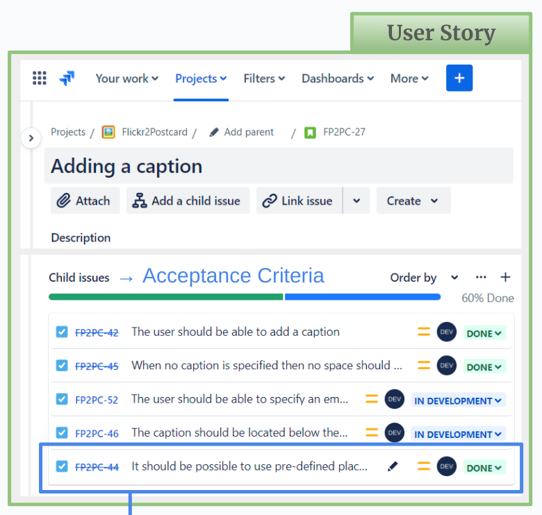

Creating **code coverage reports** is easy these days.
For every major programming language there exist tools that can analyze which lines of code have been touched by the
unit tests – and which were not.
With the help of these reports it is easy to find gaps in the test coverage and to locate dead code.


Getting a **feature coverage report** is much harder.
A code coverage tool doesn't know anything about the features and how they are connected to the code or to the tests.
A project management tool on the other hand has all the information about the features, but has no clue about how they
are linked to the tests.


In this article we will discover what is - in general - needed to generate such a feature coverage report.
And you will learn how it can be implemented in Jira, how to manage the user stories, requirements and acceptance tests,
how to come up with a useful coverage metric and how to actually visualize the numbers.

<!--more-->

⚠️ To keep it simple I will use the words **feature** and **user story** interchangeably.
In reality, they describe different things.
A feature comes to life by implementing multiple user stories.
It is enclosed and consistent, while user stories might overlap, deprecate over time or even be in conflict with
each other.
In this article I will assume that one feature consists of exactly one user story and that both describe the same thing.
This simplification will not change the overall conclusion, but expect the implementation in the real world to be a bit
more complicated.
**Hint:** How do you identify a "feature" in Jira?
User stories are easy, but how does a feature materialize?
How can you select, filter or count features?

## Who reads these reports?

When we look at the _code coverage_, then this report is only relevant for developers.
Stakeholders are normally not interested in the code or the unit tests or any code coverage metric.
They want to know that the requested feature has been implemented and that it has been tested and approved by "their"
people (PO, QA, BIZ or the stakeholder themself).
The devs on the other hand don't necessarily care about the _feature coverage_.
They are not even responsible for the overarching business tests,
see [Is the test pyramid compatible with BDD?](/articles/is-the-test-pyramid-compatible-with-bdd/2024/02/).

So, there is a clear separation between developer tests and business tests and their respective coverage reports.
This means, we can completely ignore the relationships between _feature_, _code_ and _developer tests_.
Only the relationship between _feature_ and _business test_ is relevant for this discussion.


## Basic requirements

No matter which tool(s) we want to use, for a working feature coverage solution we need to be able

* to create entities that can store the feature requests
* to create entities that can store the acceptance tests
* to connect a feature request with an acceptance test
* to count the amount of feature requests
* to count the amount of acceptance tests
* to determine how many feature have (or don't have) tests connected to them.

This is the absolute minimum.
We will later see that we should also add an entity type to represent the acceptance criteria.

### Jira integration

When using **Jira** as the project management tool we can achieve the first three requirements quite easily.
We create a _user story_ ticket for each feature request
(reminder: in this article we assume a feature to be the same as a story).
For the _acceptance tests_ we can either create a custom ticket type on our own or install one of the many test
management plugins out there (Xray, Zephyr, Tricentis, etc.), which will do the heavy-lifting for us.
Linking two tickets together is a core feature of Jira.
So, connecting a _user story_ ticket with a _test_ ticket is also easy.

The counting part is a bit harder.
Jira search, Jira JQL and the Jira dashboards are mainly designed to show a list of tickets that satisfy a specific
filter query.
They are not meant to aggregate, calculate or output _numbers_ in any way.
In order to achieve this we will need a few add-ons.

#### Jira Plugins

In my experiments I have used three different Jira plugins (links can be found at the end of the article).
You can of course pick other alternatives for your project.
Depending on your Jira and project structure you might not even need all of them.

* **Xray**: Test management tool from Xblend; adds the ticket type "Test" to Jira; can be used for manual and automated
  tests
* **ScriptRunner**: Automation tool from Adaptavist; extends the Jira search to be able to search for parent and child
  issues
* **Gauge Gadget**: Visualizer from Akeles; extends the Jira dashboard to show filter results as numbers and to combine
  the results of two filters

## A simple metric

Now we can think about the metric.
What exactly do we want to count?
A code coverage report counts the number of lines that have been touched by at least one unit test.
Following this logic, for a feature coverage report we need to count the number of features/stories that are touched by
at least one acceptance test.
When we have this information we can calculate the percentage of covered (resp. not covered) features.

This is not yet the perfect metric, but it is a starting point.
It allows us, for example to implement a rule that prohibits a deployment when there exist stories which have no tests,
yet.
We can visualize this information for the whole team by creating a Jira dashboard.
The following JQL queries give you a hint how to create the filters you need for the dashboard widgets.
For your project you probably want to adjust them, so they ignore tickets that are not in the right status, or don't
have the correct label, or don't belong to the current sprint, etc.

_Get all User Stories:_

```SQL
project = <PROJECT_KEY> AND issuetype = Story
```

_Get all Tests:_

```SQL
project = <PROJECT_KEY> AND issuetype = Test
```

_Get all User Stories with Tests:_

```SQL
project = <PROJECT_KEY> AND issuetype = Story
AND issueLinkType = "is tested by"
```

_Get all User Stories with missing Tests:_

```SQL
project = <PROJECT_KEY> AND issuetype = Story 
AND (issueLinkType IS EMPTY OR issueLinkType != "is tested by")
```

A resulting dashboard could then look something like that:


## An advanced metric

From a stakeholder's perspective, having only one acceptance test per user story is not very reassuring.
We could make the rule stricter and enforce a specific amount of tests, e.g. _"Each user story needs to have at least
five acceptance tests"_.
But this approach will not work very well, because there are smaller and bigger stories, simpler and more complex ones.
In some cases five tests are not enough to cover every relevant aspect, and in other cases we have to "invent" test
cases, just to meet this arbitrary quota.

The underlying problem here is that we have no access to the list of acceptance criteria (AC).
The number of items on that list would be the best approximation for the real size of the user story.
But, very often these ACs are buried somewhere in the user story - either embedded in the description or in form of a
random bullet point list or table.
This makes it impossible to extract and evaluate the ACs automatically.

One way to solve this issue is to **make the ACs first-class citizens**.
Meaning, they become stand-alone tickets with their own ticket type.
By doing this, we are now able to attach the tests to the ACs and the ACs to the user story.
This creates a ticket chain which can be evaluated automatically.
Instead of guessing what a "good" number of acceptance tests could be we just count the ACs that are attached to the
user story.
Our deployment rule could now be something like: _"Each user story needs to have at least one AC and each AC needs to
have at least one test."_
Or we can be stricter and demand each AC to have at least two tests - one for the happy and one for the unhappy path.

Depending on the project and the criticality of the application this might still not be the ideal solution, but it is a
huge improvement compared to the previous version.
Having for example a 90% test coverage here leads to a much higher confidence than having 90% in the simple metric.

### Jira integration

#### Tickets and relationships

To store the acceptance criteria we need a dedicated ticket type.
One option is to re-designate the user story's "sub-tasks" to be ACs.
Using sub-tasks has the advantage that those tickets have a very high cohesion in Jira.
They cannot be (accidentally) disconnected from their parent ticket and they can only have exactly one parent.
This is perfect, because we definitely **don't** want to share ACs between multiple user stories.
They are supposed to be exclusive.

Depending on your project structure and/or project type this approach might not work for you.
For example, "team-managed" projects cannot have multiple sub-task types in Jira.
You would lose the option to create "real" sub-tasks.
An alternative option is to create a completely new issue type with a new link type.
You will have to give up the high cohesion, but the general concept is the same.

As described above, the acceptance tests have to be connected to the ACs and the ACs have to be connected to the user
story.
You can use the standard "relates to" relationship or create a custom one.

The following screenshots show how this ticket chain could look like in a real project.
(The ticket descriptions are truncated to keep the images as compact as possible.)




#### Coverage queries

The final step is to calculate and actually show the coverage numbers.
As discussed above we will make use of a few Jira plugins to achieve this.
When we created the queries for the simple metric we were able to use completely standard JQL commands.
But to analyze the ticket chain for the advanced metric we need the power of **ScriptRunner**.
We have to find and select child and parent tickets at the same time, which is not possible with standard JQL.

To keep the queries readable I strongly recommend to split them and save each sub-query in a separate filter.
The following examples show how this could look like.
The first three are for preparation and to collect partial results.
The last query combines them and determines how many user stories are actually covered by tests.
The first two queries can be created with default JQL.
The other two only work with ScriptRunner.

_Get all Tests:_

```SQL
# Filter name: "All Tests"
project = <PROJECT_KEY> AND issuetype = Test
```

_Get all Acceptance Criteria:_

```SQL
# Filter name: "All ACs"
project = <PROJECT_KEY> AND issuetype = "Acceptance Criteria"
```

_Get all Acceptance Criteria that have at least one Tests:_

```SQL
# Filter name: "ACs with Tests"
issueFunction in linkedIssuesOf(filter = "All Tests")
AND filter = "All ACs"
```

_Get all User Stories that have at least one AC, which have at least one Test:_

```SQL
# Filter name: "Covered Stories"
issueFunction in parentsOf(filter = "ACs with Tests")
```

To find the stories that are **not** covered by tests we need the following queries:

_Get all User Stories:_

```SQL
# Filter name: "All Stories"
project = <PROJECT_KEY> AND issuetype = Story
```

_Get all User Stories with missing ACs:_

```SQL
# Filter name: "Stories without ACs"
issueFunction NOT in parentsOf(filter = "All ACs") 
AND filter = "All Stories"
```

_Get all ACs with missing Tests:_

```SQL
# Filter name: "ACs without Tests"
issueFunction NOT in linkedIssuesOf(filter = "All Tests") 
AND filter = "All ACs"
```

_Get all User Stories that are missing ACs and/or Tests:_

```SQL
# Filter name: "Not-covered Stories"
filter = "Stories without ACs" 
OR issueFunction in parentsOf("filter = 'ACs without Tests'")
```

#### Dashboard visualization

To show the coverage on the Jira dashboard we need a suitable widget.
At first glance the "pie chart" looks very promising.
It could spread the results into two segments, one for the user stories that are covered with tests and one for those
that are not.
Together, both segments would/should add up to 100%.
But the Jira pie chart can only operate on **one** input filter.
The segments are determined by grouping the results of this **one** filter by the wanted property (e.g. status or
assignee).
In order for this approach to work, each result item would need to carry a property that tells us the coverage status.
Creating such a query seems not to be possible in JQL.

When using to the Gauge widget from Akeles it gets easier.
This plugin expects **two** input filters - one to be able to determine the progress and one for the total number of
tickets.
In our case "progress" is the number of covered stories and "total" is the number of stories overall.

The following screenshot shows an example dashboard with three different metrics that are created this way.
In the left column we see the feature coverage.
In this case 67% of the user stories are covered with ACs, which in turn are also covered with tests.
The middle column shows how well the ACs themselves are covered with tests.
In this case 95% are covered, meaning that 5% of the ACs still need tests.
The right column tracks how many of the tests are specified.
In this case 95% are done, meaning that 5% of them are not fully specified yet.
The tables below each gauge show the "opposite" information in form of a ticket list.
They use the standard "Filter Results" widgets.


## Conclusion

For greenfield projects it is relatively easy to implement the discussed Jira adjustments.
Integrating the changes into an existing project will be more challenging.
If you already have user stories and tests in Jira, then the biggest hurdle is to squeeze in the acceptance criteria
between user story and test.
But, as outlined in the article you can start small, with a simple metric.
Connecting stories with tests properly and having a Jira filter that can tell you which stories have no tests yet is
already a big improvement.
This solution can be implemented with standard Jira tools and does not need any 3rd-party plugins.

In the end, the primary goal of these reports is to increase the stakeholder's confidence in the product.
For the developers these coverage reports might be interesting, but not necessary.
For a tester the coverage numbers are less relevant than the test executions itself.
But for a stakeholder this is valuable information.
They are the farthest away from the actual development of a feature.
They have to "believe" the devs and testers when they say _"Everything works"_ and _"Everything is tested"_.
With the coverage numbers (and ideally a proper test execution report) they have some hard facts that can significantly
help with the decision to go live or to request more tests first.

## Links

* List of Test Management Tools for Jira: https://marketplace.atlassian.com/search?query=test%20management
* Xray for Jira: https://marketplace.atlassian.com/apps/1211769/xray-test-management-for-jira?hosting=cloud&tab=overview
* ScriptRunner for Jira: https://marketplace.atlassian.com/apps/6820/scriptrunner-for-jira?tab=overview&hosting=cloud
* Gauge Gadget: https://marketplace.atlassian.com/apps/1211976/gauge-gadget?hosting=datacenter&tab=overview
