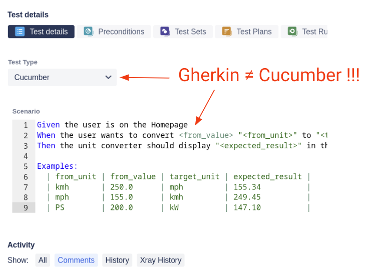

The terms **Gherkin**, **Cucumber** and **BDD** are closely related.
They mostly appear in the same context, but they are distinctly different things and cannot be used interchangeably.
In discussions, online articles or even in big test management tools they often get mixed up. 

If you try to find _"Gherkin alternatives"_ in your favorite search engine you will be presented with many _Cucumber_ alternatives, but nearly no results for _Gherkin_.

The test management tool "Xray" - a 3rd party plugin for Jira - is also a bit sloppy when it comes to the wording. 
You can switch the "Test Type" to "Cucumber" to then enter a "Gherkin" scenario into the input field below!?!



Another common misconception is when people write tests in Gherkin and then think they are doing BDD. 
Spoiler alert: this is (often) not the case. 

<!--more-->

## So, what is the difference?

**BDD** (Behavior-driven Development) is an idea, a concept, an approach to produce better software. 
Like ATDD, API-driven development, domain-driven development or TDD it gives you a rough direction and some cornerstones, but not a step-by-step manual.
You have to adjust it to your needs and fill the whole process with life.

**Gherkin** is a very simple language that lets us specify the behavior of a feature in human and(**!**) machine-readable form.
It has very little rules and is easy to learn.

```Gherkin
Scenario: It should not be possible to login with invalid credentials 
  Given the user is on the login page
  When the user tries to login with invalid credentials
  Then the user should see an error message
```

With **Cucumber** we can implement those Gherkin specifications and run them as automated tests.
The primary scope for Cucumber are end-2-end tests, but it can also handle API tests or low-level code.

```JavaScript
When('the user tries to login with invalid credentials', () => {
  cy.get('#username')
    .type('invalid');
  cy.get('#password')
    .type('invalid');
  cy.get('#submitButton')
    .click();
});
```

## How is this all connected?

In BDD (Behavior-driven Development) each feature goes through three phases in the development process: _Discovery_, _Formulation_ and _Automation_.
In **Discovery** we make sure that everyone has understood the goal of the feature, what the stakeholder wants to achieve with it and what the concrete requirements are.
This phase heavily relies on a good collaboration and communication between all parties (PO, QA, Dev, Business, UI/UX, etc). 

The **Formulation** phase is about writing down these requirements in such a way that we are able to create a so-called "living documentation" for our application.
To achieve this, the requirements need to be structured in a way that humans and(!) machines can read them. 
We humans need to be able to understand the intention of the feature and the machine needs to be able to run automated tests against this specification.
Combining both aspects leads to a living documentation, which will be discussed in another article. 
To formulate the specification, there are a handful of options on the market - for example the _robot framework_.
But, in the BDD world _Gherkin_ has established itself as the most prominent language.

In the **Automation** phase the specification is converted to code that can be executed against the system under test.
There are many tools out there, being _Cucumber_ the most prominent one.
It was originally written in Ruby, but today there are ports for many other programming languages (like Java, PHP, JavaScript or Go).
There also exist plugins for test automation tools that don't support Gherkin and/or Cucumber out-of-the box.

## Example Toolchain

To see a real-life example you can check out my demo project: [github.com/dgerike/more-cars-e2e-tests](https://github.com/dgerike/more-cars-e2e-tests).
It shows you how the pieces are connected, what happens when and where, which toolchain can be used, etc.

All specifications are formulated in Gherkin. 
They are a result of multiple discovery phases (one per feature). 
The Gherkins are stored in Jira/Xray tickets (single source of truth) and then synced down to the repository (see `cypress/integration/e2e` folder).

The Gherkin scenarios are then implemented with Cypress (see `cypress/support/step_definitions` folder). 
Officially, Cypress has no support for Gherkin or Cucumber. 
It first needs to be extended with a plugin, so it is able to parse the Gherkin files and to understand the Cucumber-like code syntax.

After the tests have been implemented they can then be executed in a GitHub Actions pipeline (see `.github/workflows`).
This will run every test and then upload the test results back to Jira/Xray.

## Links
* Gherkin introduction: [cucumber.io/docs/gherkin/reference/](https://cucumber.io/docs/gherkin/reference/)
* BDD introduction: [cucumber.io/docs/bdd/](https://)
* List of Cucumber ports: [cucumber.io/docs/installation/](https://cucumber.io/docs/installation/)
* Xray for Jira: [marketplace.atlassian.com/apps/1211769/xray-test-management-for-jira](https://marketplace.atlassian.com/apps/1211769/xray-test-management-for-jira?tab=overview&hosting=cloud)
* Gherkin/Cucumber plugin for Cypress: [github.com/badeball/cypress-cucumber-preprocessor](https://github.com/badeball/cypress-cucumber-preprocessor)
* Demo project: [github.com/dgerike/more-cars-e2e-tests](https://github.com/dgerike/more-cars-e2e-tests)
