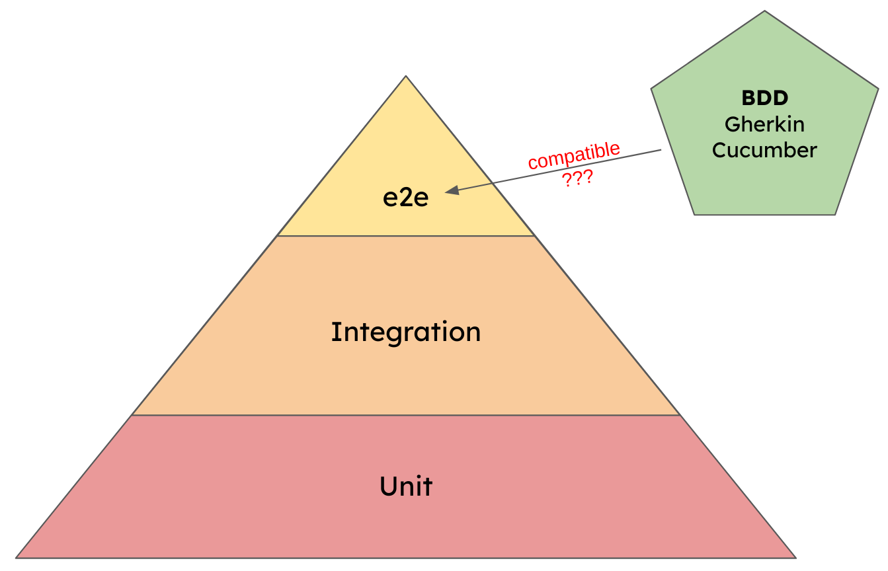

The test pyramid is a popular metaphor to describe how the testing efforts should be distributed in a software development project. 
It recommends having many unit tests, some integration tests and a few end-2-end tests.

One of the motivations behind BDD is to create a living documentation, usually described with Gherkin scenarios and implemented with Cucumber tests. 
Those Cucumber tests are often seen as the tip of the testing pyramid. 
But is this a valid assumption?

<!--more-->

## Test pyramid in a nutshell

Over the years many different variants of the test pyramid have been discussed (e.g. the ice cream cone, cupcake or hour glass).
But, for this discussion we only need the classic pyramid.
It breaks down the automated tests in three layers.

### Unit tests
Unit tests build the foundation and should be - by numbers - the largest test suite.
They test small chunks of code, are isolated from other dependencies, and are therefore extremely fast to execute.

Example: Tests that verify that the login function works.

### Integration tests

Integration tests verify that the units are working together, not just work in isolation.
To properly test that the units can be integrated into the system there are fewer options to create mocks or stubs.
Therefore, those tests are slower to run und the test suite needs to be smaller.
 
Example: Tests that verify that using the login function triggers the creation of a session.

### End-2-End tests 

The tip of the test pyramid is known under many names: acceptance tests, UAT, end-2-end tests, UI tests, GUI tests, etc.
What they all have in common is that they test a path through the system from the user's perspective.
Those tests focus on the behavior of the system (the "what"), while unit and integration tests focus on the implementation details (the "how").
In general, e2e tests are much slower because they require a deployed and running instance of the application.

Example: Tests that verify that the user is redirected to the dashboard after a successful login.

## BDD in a nutshell

In BDD (behavior-driven development) each feature goes through three phases: Discovery, formulation and automation.
The job of the discovery phase is to create a shared understanding between everyone involved.
In the formulation phase a specification document is produced that is human- and machine-readable.
And the result of the automation phase should be a living documentation.

This is explained in more detail in the article [Gherkin vs Cucumber vs BDD - What is the difference](/articles/gherkin-vs-cucumber-vs-bdd-what-is-the-difference/2024/01/). 

## Combining BDD and the test pyramid

At first glance there doesn't seem to be much overlap between BDD and the test pyramid.
But, at the end of the day, an automated BDD test is nothing more than a plain old e2e test.
It tests one aspect of the application from the end user's perspective.
Putting the BDD tests on top of the pyramid seems to be valid.
Also - by definition - the formulated BDD specification is supposed to directly guide the developer with writing their TDD tests.
So, we have a strong connection here.

But, nonetheless, the focus of BDD is not to produce tests. 
The primary goal is to specify and document the system behavior.
The automated tests are a bonus that we get for creating the living documentation.

The goal of the test pyramid is to remind the developers to invest heavily in unit tests, not to forget about the upper layers, and being careful when adding (too many) e2e tests.
The important part is that the pyramid belongs to the developers.
They decide which tools they use and how much they test on each layer.

The BDD tests on the other hand belong to the business.
Business decides how complex and detailed the Gherkin scenarios (and therefore the Cucumber tests) should become.
When the BDD tests are now part of the test pyramid, then suddenly business dictates what and how much the devs have to test.
Then the construct becomes a shared pyramid and cannot fulfil its original intention anymore.

## Conclusion

BDD as a concept primarily helps the business, the test pyramid metaphor primarily helps the developers. 
Both have their right to exist and both can co-exist.
But mixing them does not work well. 
Developers can and should have e2e tests, but they should decide about the amount, the detail and the technology themselves.
Therefore, business has to have their own test suite for the BDD tests.
They may influence what happens in the test pyramid (remember: BDD should drive the TDD tests), but they should not be able to dictate it.

## Links

* https://www.smashingmagazine.com/2023/09/long-live-test-pyramid/#all-hail-the-mighty-test-pyramid
* https://cucumber.io/blog/bdd/bdd-approval-testing-and-visualtest/
* https://khushiy.com/2019/02/07/test-pyramid-antipatterns/
